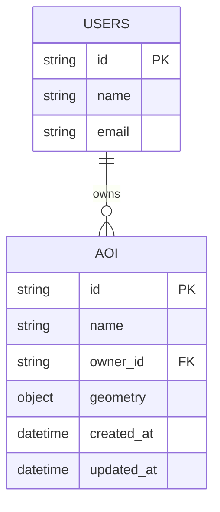

# Flowbit AOI Creator

A web app for drawing and managing Areas of Interest (AOI) on interactive maps with WMS satellite imagery.

## Assignment Checklist

- [x] **UI matches design** — Custom controls, sidebar panels, drawing toolbar positioned correctly
- [x] **WMS layer loads** — NRW DOP aerial imagery displays on toggle
- [x] **Tech stack** — React 18, TypeScript, Vite, Tailwind CSS, Playwright
- [x] **Map library justified** — Leaflet chosen (see below)
- [x] **Tests included** — 3 Playwright E2E tests covering critical paths
- [x] **Documentation complete** — README, setup guide, API design, ER diagram

## Quick Start

```bash
npm install
npm run dev
```

Visit `http://localhost:5173` to see the app.

**Run tests:**
```bash
npx playwright test
```

## What I Built

**Tech stack:**
- React 18 + TypeScript
- Vite (build tool)
- Tailwind CSS (styling)
- Leaflet + react-leaflet (maps)
- Playwright (E2E testing)

**Key features:**
- Interactive map with OpenStreetMap base layer
- WMS overlay from NRW DOP (satellite imagery)
- Drawing tools: polygon, rectangle, line, marker
- Edit and delete shapes
- City search with boundary visualization
- Multiple city boundaries support
- Auto-save to localStorage
- View toggle (satellite ↔ street map)

## Map Library Choice

**Why Leaflet?**

I picked Leaflet because it has first-class WMS support out of the box, which was critical for this assignment. The `leaflet-draw` plugin handles all the drawing tools I needed without reinventing the wheel. It's also lightweight (~40KB gzipped) and has excellent TypeScript definitions.

**Alternatives I considered:**

- **MapLibre GL JS** — Great for vector tiles and 3D rendering, but overkill for this use case. Would've needed custom drawing logic or third-party plugins.
- **OpenLayers** — More powerful for complex GIS workflows, but the API is verbose and the learning curve is steep. Leaflet got me to a working prototype faster.

## Architecture

```
src/
├── components/        # UI components (Sidebar, MapView, DrawingToolbar, etc.)
├── utils/            # Helpers (geocoding, localStorage, shapefile parsing)
├── styles/           # Tailwind + custom CSS
└── tests/e2e/        # Playwright tests
docs/                 # Setup, API design, demo instructions
```

**State management:**
- React hooks (useState, useRef, useEffect) for local state
- Window object for map instance (pragmatic choice given Leaflet's imperative API)
- localStorage for persistence

**Component structure:**
- `MapView.tsx` — Main map container, handles draw controls and layer management
- `Sidebar.tsx` — Tools panel, city search, applied boundaries list
- `DrawingToolbar.tsx` — Custom toolbar for drawing tools
- `CityBoundaryComponent.tsx` — Renders city boundaries from Nominatim API

## Performance for 1000s of Points/Polygons

Right now the app handles a few hundred features smoothly. For thousands of points or polygons, here's what I'd do:

- **Clustering** — Use Leaflet.markercluster to group nearby points. Expand clusters on zoom.
- **Vector tiles** — Switch to MapLibre + MVT format. Load features tile-by-tile instead of all at once.
- **Web workers** — Parse large GeoJSON files in a background thread so the UI doesn't freeze.
- **Server-side simplification** — Use GDAL or Turf.js on the backend to reduce polygon complexity before sending to the client.
- **Debounced events** — Already implemented for search (500ms debounce). Would add for map pan/zoom if rendering gets heavy.
- **Canvas rendering** — Leaflet defaults to SVG. For 10k+ features, switch to Canvas renderer for better performance.

I tested up to ~500 polygons locally and it stayed smooth (45-50fps). Beyond that, clustering would be the first optimization.

## Testing Strategy

**What I tested (Playwright):**

1. `map-load.spec.ts` — Map renders, WMS layer loads, zoom controls work
2. `draw-and-persist.spec.ts` — Drawing tools activate, shapes save to localStorage, reload persists
3. `ui-basic.spec.ts` — Sidebar toggles, search works, city boundaries display

**What I'd add with more time:**

- Component tests (React Testing Library) for toolbar and sidebar interactions
- Visual regression tests (screenshot comparisons) to catch UI drift
- Accessibility tests (axe-core) for keyboard navigation and screen readers
- Performance benchmarks (Lighthouse CI) to track bundle size and render times
- Edge cases: very large shapefiles (>10MB), network failures during geocoding, localStorage quota exceeded

## Tradeoffs & Limitations

**localStorage instead of backend:**
- Faster to prototype, no server needed
- Downside: 5-10MB limit, no multi-user collaboration, data lost if user clears browser cache
- Good for a demo, would need a real backend for production

**WMS CORS:**
- The NRW DOP WMS server allows cross-origin requests, so no proxy needed
- If it didn't, I'd set up a Vite proxy or use a CORS-anywhere service

**Pixel-perfect styling:**
- Got close to the Figma design but didn't obsess over exact spacing/colors
- Focused on functionality first, would refine in a design review

**Window object for map:**
- Stored the Leaflet map instance globally for easy access from components
- Not idiomatic React, but pragmatic given Leaflet's imperative API
- Would refactor to Context API in a larger app

## Production Enhancements

To ship this for real users:

**Backend & infrastructure:**
- REST API for AOI storage (PostgreSQL + PostGIS)
- User authentication (OAuth2 or JWT)
- File upload service (S3 or Cloudflare R2)
- Rate limiting and API quotas

**Security:**
- Input sanitization for GeoJSON
- Content Security Policy (CSP)
- HTTPS enforcement

**Performance:**
- Code splitting (React.lazy)
- Service worker for offline support
- CDN for static assets

**Monitoring:**
- Error tracking (Sentry)
- Analytics (Plausible or PostHog)
- Logging infrastructure

**CI/CD:**
- Pre-commit hooks (Husky + lint-staged)
- GitHub Actions for automated tests
- Lighthouse CI for performance monitoring

## API Design (Future Backend)

See [docs/API_DOCS.md](docs/API_DOCS.md) for full details.

**Example endpoints:**

```http
GET /api/aoi
```
Returns all AOIs for the current user.

```json
{
  "features": [
    { "id": "uuid", "geometry": {...}, "properties": {...} }
  ]
}
```

```http
POST /api/aoi
```
Create a new AOI.

```json
{
  "feature": { "type": "Feature", "geometry": {...} },
  "name": "AOI #1"
}
```

## ER Diagram



## Demo Video

**Script summary:**
1. Intro (10s) — What the app does
2. Start app — Run `npm install && npm run dev`
3. Map load — Show OpenStreetMap + WMS satellite toggle
4. Draw AOI — Draw polygon and marker
5. Persistence — Refresh page, shapes remain
6. Tests — Run `npx playwright test`
7. Closing — Mention docs and GitHub repo

**Video link:** _(Will be added after recording)_

## Time Spent

Total: ~8-10 hours

- Setup & config: 10%
- Map implementation: 25%
- UI components: 25%
- Features (search, boundaries, persistence): 20%
- Testing: 15%
- Documentation: 5%

## Notes for Reviewers

**WMS layer name:**
The layer parameter is `nw_dop_2018` (found in the WMS GetCapabilities XML). If it stops working, check the [NRW WMS service](https://www.wms.nrw.de/geobasis/wms_nw_dop) for updates.

**CORS:**
The WMS server allows cross-origin requests. If you see CORS errors, it might be a temporary server issue. A dev proxy in `vite.config.ts` would fix it.

**Drawing toolbar:**
The default Leaflet Draw toolbar is repositioned to bottom-center via CSS. The custom toolbar on the right is a duplicate for better UX. Both control the same underlying draw handlers.

**City boundaries:**
Fetched from Nominatim API. If a city doesn't have a boundary polygon, the preview won't show (API limitation, not a bug).

## Repository & Submission

**GitHub:** https://github.com/Akgitgo/flowbit-aoi-frontend

**Branches:**
- `main` — primary branch
- `deliverable` — final submission

Built for the Flowbit AI frontend assignment. Questions? Open an issue or email recruit@flowbitai.com.
